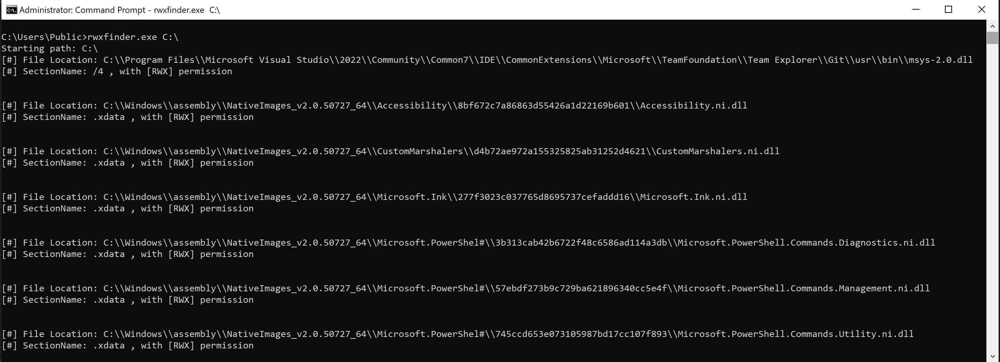

# rwxfinder
Just simple tool to find the dlls with RWX section that can be used for alternative code injection [Process Mockingjay](https://www.securityjoes.com/post/process-mockingjay-echoing-rwx-in-userland-to-achieve-code-execution   

## Usage
Just provide the spesific folder location in the argument
```
C:\>rwxfinder.exe C:\
```
Output (Tested on Windows 10 64 bit)

